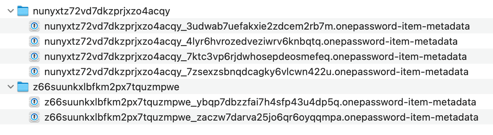
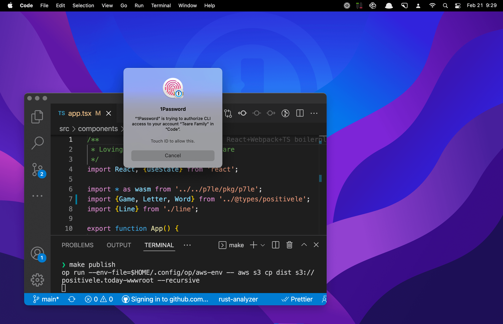

# Alfred + 1Password 8 ❤️

An exploration into integrating [Alfred](https://www.alfredapp.com) with 1Password 8 via the new [op CLI](https://developer.1password.com/docs/cli).

## History

In 1Password 7 users could enable Preferences > Advanced > Enable Spotlight and 3rd party app integrations. Doing so would create files like these within `~/Library/Containers/com.agilebits.onepassword7/Data/Library/Caches/Metadata/1Password`:



Each of these were json files with these fields:

```
{
  "uuid": "7ktc3vp6rjdwhosepdeosmefeq",
  "itemDescription": "Login from Papa🐻",
  "itemTitle": "Evernote personal",
  "vaultName": "Papa🐻",
  "vaultUUID": "nunyxtz72vd7dkzprjxzo4acqy",
  "categoryPluralName": "Logins",
  "modifiedAt": 1611606417,
  "profileUUID": "nunyxtz72vd7dkzprjxzo4acqy",
  "websiteURLs": ["https://www.evernote.com/Registration.action"],
  "categorySingularName": "Login",
  "categoryUUID": "001",
  "accountName": "Teare 👨‍👩‍👧‍👦 Fam",
  "createdAt": 1520813775
}
```

## Recreating the old format using the 1Password CLI

The 1Password CLI could be used to recreate this exact same file format. This repo contains a Rust app that gets 80% of the way there. It loads in the items and vaults for each account and (currently) writes out `items.json` files for each vault.

This could be easily extended to match the format used in 1Password 7 and used to add support Alfred integration to 1Password 8.

## Tighter integration

The CLI can do a lot more than we could ever achieve with plain text metadata files. Things like usernames could be included alongside the item titles in [1Click Bookmarks](https://www.alfredapp.com/help/features/1password/), items could be created within 1Password, and in theory the entire 1Password mini experience could be recreated.

This integration would no longer rely on unprotected plain text files, and with the new CLI users can authorize access to Alfred using Touch ID or their Apple Watch.



There are innumerable possibilities as `op` is a full-featured CLI that supports CRUD of items, vaults, and even accounts.

I'm looking forward to exploring all the possibilities this unlocks! 😍
